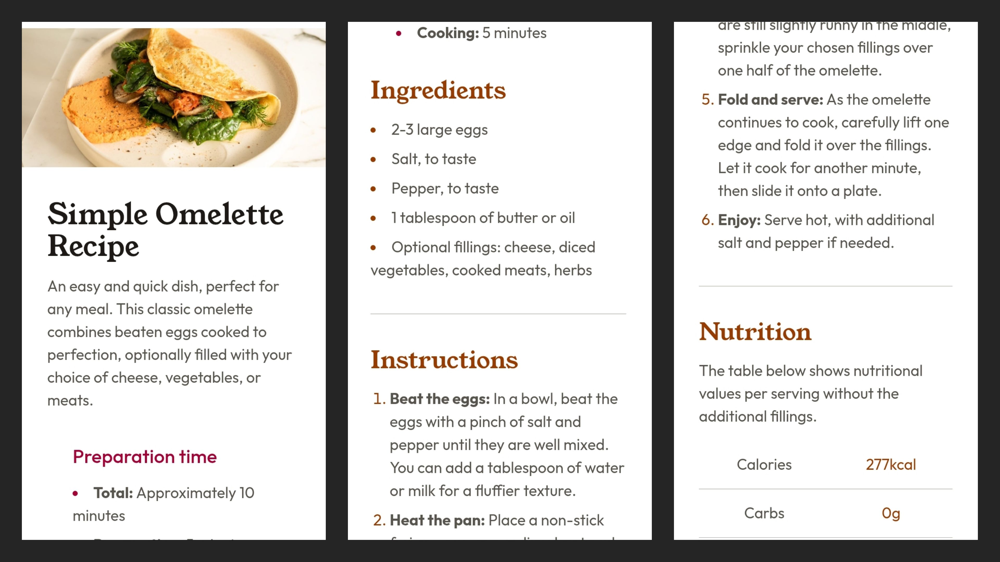
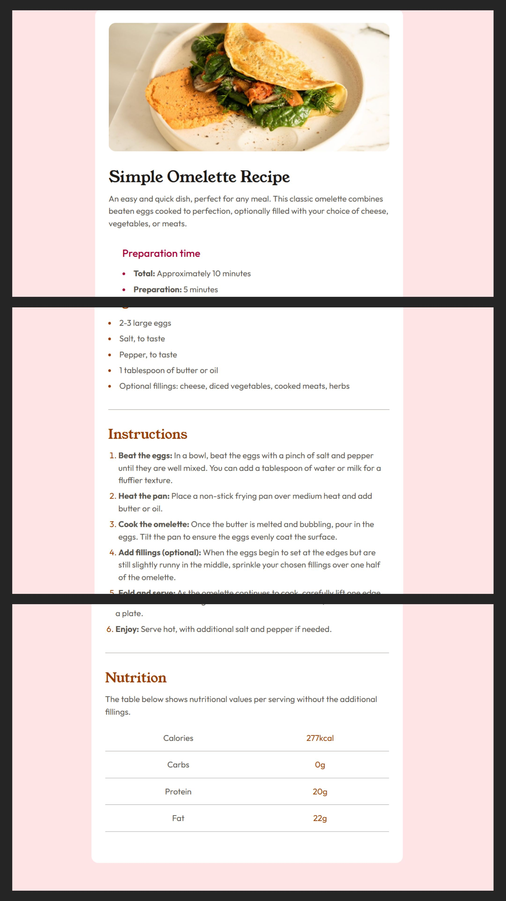

# Recipe page

A simple recipe page using semantic HTML and TailwindCSS. 

## Table of contents

- [Overview](#overview)
  - [Installation](#installation)
  - [Screenshot](#screenshot)
  - [Link](#link)
  - [Built with](#built-with)
  - [What I learned](#what-i-learned)
- [Author](#author)

## Overview
This is a beginner-level project to practise HTML and TailwindCSS.

### Installation
Installing Tailwind CLI: 

--> Note: 
  npx @tailwindcss/cli -i ./src/input.css -o ./src/output.css --watch
  (Compiles Tailwind CSS and auto-rebuilds on changes.)

### Screenshot
**Desktop**

**Mobile**

### Link

[Solution](https://github.com/sushmita-writes/Web-Development/tree/main/blog-preview-card)

### Built with

- Semantic HTML5
- TailwindCSS
- Media Queries

### What I learned

- How to use utility class in TailwindCSS
- How to use TailwindCSS's @layer directive (base and componenet layers)
- Why to use Semantic HTML tags 
- How to make a responsive layout using media queries in TailwindCSS

## Author

- Github - [sushmita-writes](https://github.com/sushmita-writes)
