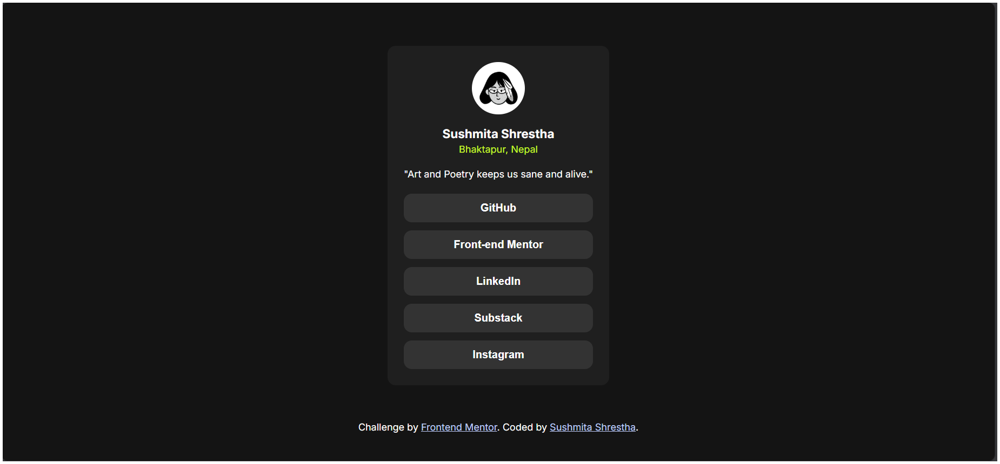
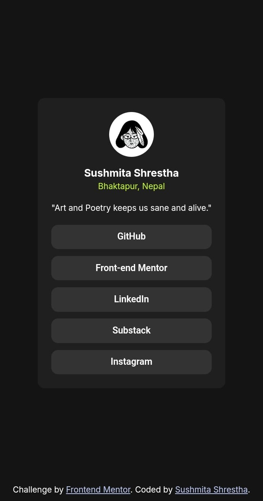

# Social Links Profile

A simple social links profile using semantic HTML, CSS and minimal JavaScript (window.open() for link navigation).

## Table of contents

- [Overview](#overview)
  - [Screenshot](#screenshot)
  - [Link](#link)
  - [Built with](#built-with)
  - [What I learned](#what-i-learned)
- [Author](#author)

## Overview
This is a beginner-level project to practise HTML and CSS. The project demonstrates styling and hover effects, with minimal Javascript.

### Screenshot
**Desktop**

**Mobile**

### Link

[Solution](https://github.com/sushmita-writes/Web-Development/tree/main/social-links)

### Built with

- Semantic HTML5
- CSS
- Flexbox
- Hover effects
- Javascript: window.open()

### What I learned

- How to use JavaScript to make buttons open links in new tabs using window.open()
- Why to use Semantic HTML tags 
- How to use Hover effects
- Working with flexbox

--> Note: 
  - window.location.href: Explored how to redirect users within the same tab by modifying the href property of the window.location object, enabling seamless navigation to external or internal pages.
  - window.open(): Implemented basic JavaScript functionality with the window.open() method to launch external links in a new tab or window, enhancing user experience by preserving the current page context.

## Author

- Github - [sushmita-writes](https://github.com/sushmita-writes)
